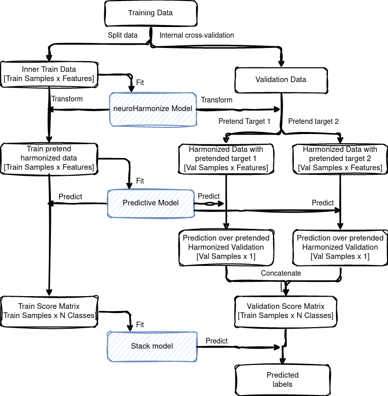

# Impact of Leakage on Data Harmonization in Machine Learning Pipelines in Class Imbalance Across Sites

## About

The Forschungszentrum Jülich Machine Learning Library

It is currently being developed and maintained at the [Applied Machine Learning](https://www.fz-juelich.de/en/inm/inm-7/research-groups/applied-machine-learning-aml) group at [Forschungszentrum Juelich](https://www.fz-juelich.de/en), Germany.


## Overview

**PrettYharmonize** is a Python package developed to address data leakage in the harmonization of biomedical datasets with site-specific variability, particularly under scenarios where class balance differs across data collection sites. Traditional harmonization methods like ComBat, while widely used, often struggle with data leakage, leading to compromised model performance. PrettYharmonize introduces a novel approach that leverages "pretending" target labels to mitigate this issue, preserving biologically relevant signals without inadvertently introducing leakage. The methodology has been validated on synthetic benchmarks and real-world data, including MRI and clinical datasets, to ensure robustness in diverse site-target-dependence scenarios.


*Figure 1: Workflow for the PrettYharmonize data harmonization approach, outlining key stages in data processing.*

For more details, see our paper on arXiv: [Impact of Leakage on Data Harmonization in Machine Learning Pipelines in Class Imbalance Across Sites](https://arxiv.org/abs/2410.19643).

## Installation

To set up the environment for PrettYharmonize, follow these steps:

1. **Clone the repository:**

   ```bash
   git clone https://github.com/juaml/PrettYharmonize.git
   cd PrettYharmonize


## Citation
```bibtex
If you use PrettYharmonize in your work, please cite the following:
@article{nieto2024impact,
  title={Impact of Leakage on Data Harmonization in Machine Learning Pipelines in Class Imbalance Across Sites},
  author={Nieto, Nicol{\'a}s and Eickhoff, Simon B and Jung, Christian and Reuter, Martin and Diers, Kersten and Kelm, Malte and Lichtenberg, Artur and Raimondo, Federico and Patil, Kaustubh R},
  journal={arXiv preprint arXiv:2410.19643},
  year={2024}
}
```

## Licensing

preattyharmonize is released under the AGPL v3 license:

preattyharmonize, FZJuelich AML machine learning library.
Copyright (C) 2020, authors of preattyharmonize.

This program is free software: you can redistribute it and/or modify
it under the terms of the GNU Affero General Public License as published by
the Free Software Foundation, either version 3 of the License, or any later version.

This program is distributed in the hope that it will be useful,
but WITHOUT ANY WARRANTY; without even the implied warranty of
MERCHANTABILITY or FITNESS FOR A PARTICULAR PURPOSE.  See the
GNU Affero General Public License for more details.

You should have received a copy of the GNU Affero General Public License
along with this program.  If not, see <http://www.gnu.org/licenses/>.